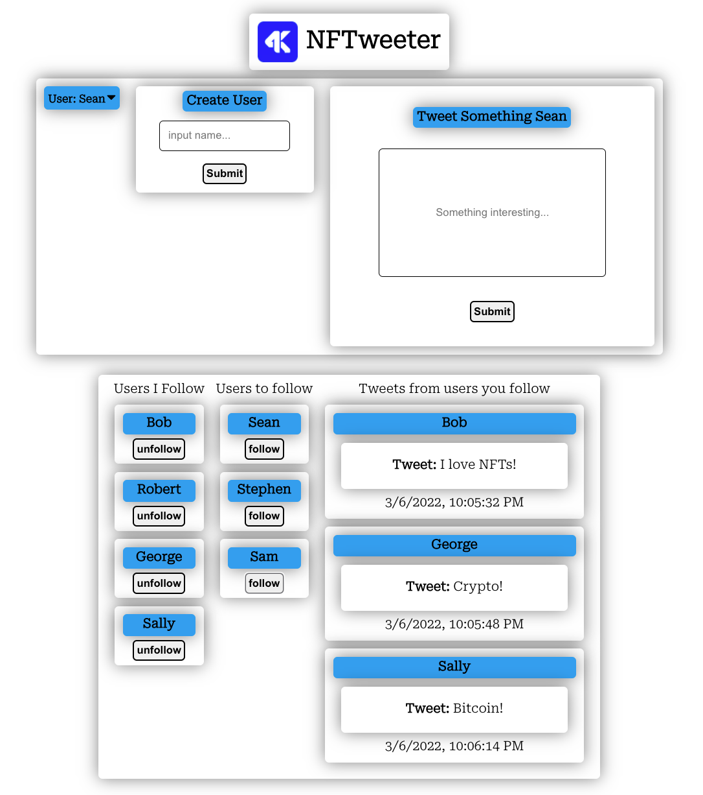

## NFTweeter

This project implements an API built with Node.js and Express to send requests to a MySql database with a React frontend.

This twitter clone allows users to:

- Post tweets
- Follow users
- Add users
- See tweets of those you follow

## Screenshots

